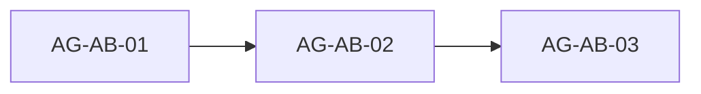

# about-section: проверка плана Skaro и блоки для агентов

## 1. Источники

- План: [.skaro/milestones/04-results-about-cta/about-section/plan.md](.skaro/milestones/04-results-about-cta/about-section/plan.md)
- Spec: [spec.md](.skaro/milestones/04-results-about-cta/about-section/spec.md)
- Tasks: [tasks.md](.skaro/milestones/04-results-about-cta/about-section/tasks.md)
- Clarifications: [clarifications.md](.skaro/milestones/04-results-about-cta/about-section/clarifications.md)

**Текущая реализация:**

- [components/sections/AboutSection.tsx](components/sections/AboutSection.tsx) — Server Component, `id="about"`, `aria-labelledby`; intro + сетка фактов (Lucide), CTA-ссылка на `#contact`.
- [lib/data/texts.ts](lib/data/texts.ts) — `about`: title, description, **features[]**, **ctaText** (данные готовы; вёрстка в AG-AB-02).
- [app/page.tsx](app/page.tsx) — `AboutSection` уже между `ResultsSection` и `CtaFormSection`.
- [navigation.ts](lib/data/navigation.ts) — пункт «О нас» → `#about`.

---

## 2. Расхождения Skaro ↔ код и решение

| Тема                           | Skaro (spec / plan / tasks)                                              | Сейчас                                                    | Решение                                                                                                                                                                                                         |
| ------------------------------ | ------------------------------------------------------------------------ | --------------------------------------------------------- | --------------------------------------------------------------------------------------------------------------------------------------------------------------------------------------------------------------- |
| **Объём контента**             | Заголовок + описание + **3–4 факта** (иконка, title, text) + **ctaText** | Только заголовок + описание                               | **Расширить** `about` и вёрстку по clarifications Q1/Q3; **сохранить** согласованный тон (MES, контур, ИИ как усиление, без узкого ИЦП).                                                                        |
| **CTA и якорь**                | Ссылка на `**#cta-form`**                                                | Секция формы имеет `**id="contact"`**                     | Использовать `**#contact`** (и при необходимости `<a href="#contact">` или `Button` как ссылка). В plan/tasks Skaro якорь **устарел**.                                                                          |
| **Одноколоночность / фото**    | NFR: без фото, текст на ширину контейнера                                | Уже так                                                   | После добавления фактов: верх — intro (как сейчас), блок фактов — сетка **не ломает** отказ от фото (clarification Q2).                                                                                         |
| **Данные**                     | Объект `about` в `texts.ts`                                              | Уже в `texts.ts`                                          | Добавить `features[]`, `ctaText`; типы в [types/index.ts](types/index.ts).                                                                                                                                      |
| **AI_NOTES**                   | Verify ожидает `AI_NOTES.md` в **корне** репозитория                     | В смежных milestone заметки в `**.skaro/.../milestone/`** | Создавать **[.skaro/milestones/04-results-about-cta/about-section/AI_NOTES.md](.skaro/milestones/04-results-about-cta/about-section/AI_NOTES.md)**; в verify Skaro путь не совпадает — зафиксировать в заметке. |
| **Методологические артефакты** | В spec не дублируются                                                    | Уже раскрыты в **HowWeWork** (artifacts)                  | В фактах About — **ценности/подход**, а не полный перечень бриф/КП/SLA (избежать дубля).                                                                                                                        |

**Итог:** противоречий с **позиционированием** нет; есть **дельта** до полного FR Skaro (факты + CTA) и **исправление якоря** относительно текста плана Skaro.

---

## 3. Порядок слияния

---

## 4. Задания для агенту

### AG-AB-01 — Данные и типы

**Цель:** Расширить модель `about` без смены смысла текущего абзаца (можно слегка отредактировать вступление при необходимости согласованности с фактами).

**Сделать:**

- В [types/index.ts](types/index.ts): тип для элемента факта, например `AboutFeature { icon: string` или общий ключ как у продуктов/`ResultsColumnIcon` — на усмотрение; поля `title`, `text`.
- В [lib/data/texts.ts](lib/data/texts.ts): массив **3–4** элементов — темы в духе: операционное управление и MES, поэтапность/пилоты, данные и аналитика, сопровождение (или близко к [.cursor/docs/Pozitsionirovanie-FactoryAll.md](.cursor/docs/Pozitsionirovanie-FactoryAll.md)); **не** вставлять ложные цифры («500 проектов»).
- Поле `**ctaText`**: например «Связаться с нами» (как в clarifications Q3).

**Проверка:** `npx tsc --noEmit`.

---

### AG-AB-02 — Компонент AboutSection

**Цель:** Server Component, палитра Primary / Accent, адаптив.

**Сделать:**

- [AboutSection.tsx](components/sections/AboutSection.tsx): заголовок + описание; сетка фактов (**1 колонка** на мобильных, **2×2 или 2+2 / md:grid-cols-2** на desktop — как в plan stage 2); иконки из `lucide-react` по ключу из данных (как в ProductCard/ResultsSection).
- CTA: ссылка или кнопка-ссылка на `**#contact`** с текстом из `texts.about.ctaText` (не `#cta-form`).
- Сохранить `**id="about"`**, без `'use client'`.
- Контейнер и отступы согласовать с соседними секциями ([ResultsSection](components/sections/ResultsSection.tsx), [ProductLineSection](components/sections/ProductLineSection.tsx)) — без резкого визуального разрыва.

**Проверка:** визуально mobile/desktop.

---

### AG-AB-03 — Интеграция, QA, документация

**Цель:** Убедиться, что ничего не сломано; задокументировать для Skaro.

**Сделать:**

- [app/page.tsx](app/page.tsx): порядок уже корректен — только подтвердить.
- [components/sections/index.ts](components/sections/index.ts): экспорт `AboutSection`.
- `npm run lint`, `npm run build`; проверка `**#about`** и CTA → `**#contact`**.
- Создать **AI_NOTES.md** в [.skaro/milestones/04-results-about-cta/about-section/](.skaro/milestones/04-results-about-cta/about-section/): обзор, реализованные FR, якорь `#contact` vs устаревший `#cta-form` в spec/plan, при желании предложение обновить [spec.md](.skaro/milestones/04-results-about-cta/about-section/spec.md) / [tasks.md](.skaro/milestones/04-results-about-cta/about-section/tasks.md).

**devplan:** [about-section](.skaro/devplan.md) уже **done**; при существенной доработке — одна строка в Change Log (по желанию).

---

## 5. Журнал ревью

| Блок     | Статус | Заметки                                                                                                                           |
| -------- | ------ | --------------------------------------------------------------------------------------------------------------------------------- |
| AG-AB-01 | готово | `AboutFeatureIcon` / `AboutFeature`, `TextsData.about` с `features` и `ctaText`; копирайт согласован; `npx tsc --noEmit` OK.      |
| AG-AB-02 | готово | Сетка md:2col, карточки, iconMap как Results; CTA `#contact`, стили как `Button` primary; tsc + lint OK.                          |
| AG-AB-03 | готово | Порядок секций и экспорт подтверждены; lint + build OK; `AI_NOTES.md` в milestone; Skaro `plan.md`/`tasks.md` — якорь `#contact`. |

---

## 6. Ревью

После блока: **«Готов AG-AB-0X»** — обновление to-do и строки журнала в этом файле.