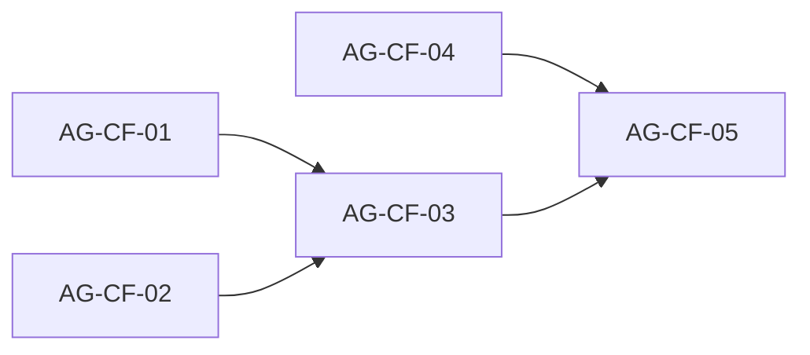

# CTA-form-and-optimization: проверка плана Skaro и блоки для агентов

## 1. Что проверено

Источники:

- План стадий: [.skaro/milestones/03-forms-and-final/cta-form-and-optimization/plan.md](.skaro/milestones/03-forms-and-final/cta-form-and-optimization/plan.md) (в заголовке указано «cta-form-and-integration» — расхождение имени с папкой `cta-form-and-optimization`, на суть не влияет).
- Spec: [.skaro/milestones/03-forms-and-final/cta-form-and-optimization/spec.md](.skaro/milestones/03-forms-and-final/cta-form-and-optimization/spec.md)
- Tasks: [tasks.md](.skaro/milestones/03-forms-and-final/cta-form-and-optimization/tasks.md)
- Уточнения: [clarifications.md](.skaro/milestones/03-forms-and-final/cta-form-and-optimization/clarifications.md)

Базовая реализация после позиционирования и AG-03: [components/sections/CtaFormSection.tsx](components/sections/CtaFormSection.tsx), [lib/data/texts.ts](lib/data/texts.ts) (`cta.form`), `NEXT_PUBLIC_FORMSPREE_ID`, таймаут fetch, mailto-fallback (ADR-005).

---

## 2. Расхождения Skaro ↔ текущий код и как их закрываем

Прямых логических конфликтов с **копирайтом позиционирования** нет: добавляются поля и UX по spec Skaro. Технически текущая форма **уже закрывает** часть стадий Skaro (Zod, Formspree, env, секция `#contact`). Ниже — **дельта**, которую нужно довести под **spec + clarifications** milestone.

| Тема           | Сейчас (после AG-03)               | Skaro (spec / plan / clarifications)                                                | Решение для milestone                                                                                                    |
| -------------- | ---------------------------------- | ----------------------------------------------------------------------------------- | ------------------------------------------------------------------------------------------------------------------------ |
| Поля           | Имя, Email, Сообщение              | Имя, Email, **Телефон**, Сообщение                                                  | Добавить **телефон**; валидация: ≥ **10 цифр** (символы игнорировать), как в clarifications Q2                           |
| Антиспам       | Нет                                | **Honeypot** для Formspree                                                          | Добавить скрытое поле (например `_gotcha` / `gotcha`), пустое у людей                                                    |
| Успех          | Сообщение + очищенные поля         | **Скрыть форму**, показать благодарность + кнопка **«Вернуться»** (Q3)              | Перейти на сценарий Skaro                                                                                                |
| Структура кода | Zod и fetch в компоненте           | Отдельно `lib/validation/contactFormSchema.ts`, `lib/utils/formspree.ts`            | Вынести по плану Skaro (без удаления поведения: таймаут **12 с**, mailto при отсутствии ID / !ok / ошибке сети)          |
| Мин. длины     | имя/сообщение min 1 после trim     | plan stage 2: имя **min 2**, сообщение **min 10**                                   | Применить пороги Skaro; тексты ошибок — на русском из `texts`                                                            |
| UI             | Нативные input/textarea            | FormInput, **FormTextarea**, **ErrorMessage**, **SuccessMessage**, Button с loading | Довести UI-kit и подключить в форме; **Button** уже имеет `isLoading` — использовать                                     |
| SEO            | Базовые title/description в layout | **robots.txt**, **sitemap.xml**, **OpenGraph**, **canonical**, **keywords**         | Выполнить stage 5 Skaro, **не ломая** текущий смысл title/description без лишнего «AI-first»                             |
| QA             | lint + build                       | bundle gzip **< 150 KB** (критерий spec), **Lighthouse** Performance/SEO **> 90**   | Проверить в AG-CF-05; при невыполнении — зафиксировать факт и причины в **AI_NOTES** (ограничения SSG/клиентского чанка) |
| `.env.local`   | Разработчик создаёт локально       | Stage 1 DoD: «создать .env.local»                                                   | Агент **не коммитит** `.env.local`; только **.env.example** и инструкция в AI_NOTES                                      |

Итог: **противоречий с позиционированием нет**; с текущей формой есть **расширение до полного scope Skaro** (телефон, honeypot, UX успеха, модули, SEO, метрики).

---

## 3. Порядок слияния (рекомендуемый)

- **AG-CF-01** и **AG-CF-02** можно вести **параллельно в разных чатах**, если не правят одни и те же файлы; при конфликте — сначала CF-01, затем CF-02.
- **AG-CF-03** — после слияния CF-01 и CF-02 (форме нужны и схема/утилита, и UI).
- **AG-CF-04** (SEO) не трогает `CtaFormSection`; может идти **параллельно с CF-01/02** или **до CF-03**; перед финальным QA убедиться, что `layout` единый.
- **AG-CF-05** — после CF-03 и CF-04.

---

## 4. Готовые задания для вставки агенту

### AG-CF-01 — Схема валидации и утилита Formspree

**Цель:** Вынести валидацию и HTTP-слой из [CtaFormSection.tsx](components/sections/CtaFormSection.tsx) без изменения пользовательского сценария fallback.

**Создать:**

1. `lib/validation/contactFormSchema.ts` — Zod:
  - `name`: trim, минимум **2** символа;
  - `email`: валидный email;
  - `phone`: минимум **10 цифр** (подсчёт через извлечение `\d`);
  - `message`: минимум **10** символов (после trim);
  - `_gotcha` (или имя, совместимое с Formspree honeypot): опционально, должно быть пустым;
  - сообщения об ошибках на русском — либо параметризуемые, либо константы + позже перенос в `texts` в CF-03.
2. `lib/utils/formspree.ts` — функция отправки POST JSON на `https://formspree.io/f/${id}`, **AbortController**, таймаут **12 с**, возврат `boolean` или Result; без UI.
3. [types/index.ts](types/index.ts) — типы `ContactFormData`, при необходимости `FormStatus` / состояние формы (как в plan stage 2).

**Не менять:** `CtaFormSection` можно не трогать в этом блоке (интеграция в CF-03).

**Проверка:** `npx tsc --noEmit`; импорт схемы из тестового вызова или временного скрипта не обязателен.

---

### AG-CF-02 — UI-компоненты формы

**Цель:** Подготовить переиспользуемые компоненты под spec Skaro.

**Файлы:**

- [components/ui/FormInput.tsx](components/ui/FormInput.tsx) — отображение ошибки (рамка + текст), `aria-invalid`, связь с `aria-describedby`.
- **Новый** `components/ui/FormTextarea.tsx` — аналогично для многострочного поля.
- **Новый** `components/ui/ErrorMessage.tsx` — блок общей ошибки (можно с иконкой, палитра проекта).
- **Новый** `components/ui/SuccessMessage.tsx` — текст успеха + кнопка **«Вернуться»** (сброс состояния через callback prop).
- [components/ui/Button.tsx](components/ui/Button.tsx) — уже есть спиннер при `isLoading`; при необходимости выровнять стили с формой.
- [components/ui/index.ts](components/ui/index.ts) — реэкспорты.

**Проверка:** ESLint на изменённых файлах; визуально — по story не требуется, достаточно использования в CF-03.

---

### AG-CF-03 — Рефакторинг CtaFormSection

**Цель:** Соединить CF-01 + CF-02 и выполнить clarifications/spec.

**Уже после AG-CF-02:** секция использует `FormInput` / `FormTextarea` / `ErrorMessage` / `Button` / `SuccessMessage`; сценарий успеха (скрытие формы + «Вернуться») реализован.

**Сделать:**

- Подключить `contactFormSchema` и `submitContactFormToFormspree` из CF-01; **удалить** локальный `buildSchema`, `submitToFormspree` и дублирующий `z` в компоненте, если они останутся.
- Поля: имя, email, **телефон**, сообщение; скрытый **honeypot**.
- Ошибки полей — из Zod; тексты подписей/placeholder/валидации/success/error/fallback — из [lib/data/texts.ts](lib/data/texts.ts) (расширить `cta.form` и при необходимости добавить ключи для телефона и кнопки «Вернуться»).
- **Успех:** скрыть поля формы, показать `SuccessMessage`; «Вернуться» — сброс в состояние заполнения формы.
- Сохранить: `NEXT_PUBLIC_FORMSPREE_ID`, при отсутствии / `!res.ok` / сетевой ошибке — сообщение + **mailto** (как сейчас), `NEXT_PUBLIC_CONTACT_EMAIL` с дефолтом на `hello@factoryall.ru`.
- Удалить дублирующий inline-Zod из компонента после подключения схемы.
- Контекст состояния можно оставить или упростить — без регрессии UX.

**Проверка:** ручной сценарий из clarifications; якорь `#contact` не сломать.

---

### AG-CF-04 — SEO (stage 5 Skaro)

**Цель:** Статические файлы и метаданные без конфликта с текущей политикой title/description.

**Сделать:**

1. `public/robots.txt` — Allow, указать URL **sitemap** (абсолютный URL продакшена: вынести в комментарий/placeholder или базовый домен проекта, согласованный с вами — например `https://factoryall.ru`; если домен не финален, в AI_NOTES описать подстановку при деплое).
2. `public/sitemap.xml` — одна запись на главную (тот же базовый URL).
3. [app/layout.tsx](app/layout.tsx) — расширить `metadata`: `keywords`, `openGraph` (title, description, type, image), `alternates.canonical` (тот же базовый URL).
4. Изображение OG: либо [app/opengraph-image.png](app/opengraph-image.png) / статический ассет по документации Next 15 для App Router, либо `metadata.openGraph.images` на файл в `public/` — выбрать один поддерживаемый вариант для **output: 'export'** (при сомнении — положить изображение в `public/og.png` и сослаться в metadata).

**Проверка:** после `npm run build` файлы `out/robots.txt`, `out/sitemap.xml` доступны (как копии из `public/`).

---

### AG-CF-05 — Регрессия, метрики, документация

**Цель:** Закрыть stage 6 Skaro и зафиксировать компромиссы.

**Сделать:**

- `npm run lint`, `npm run build`.
- Проверка размера бандла по смыслу [verify.yaml](.skaro/milestones/03-forms-and-final/cta-form-and-optimization/verify.yaml): для `output: 'export'` артефакты в `out/_next/static/chunks` (учесть PowerShell-команды из verify или эквивалент).
- Lighthouse (локально или CI) — по возможности; если **< 90** или **> 150 KB** gzip — описать в заметках.
- Создать **AI_NOTES.md** в [.skaro/milestones/03-forms-and-final/cta-form-and-optimization/](.skaro/milestones/03-forms-and-final/cta-form-and-optimization/) (архитектура формы, env, honeypot, fallback, SEO, отличия от ранней 3-полевой версии).
- Обновить [.skaro/devplan.md](.skaro/devplan.md): задачи `cta-form-section`, при необходимости `seo-metadata` / `images-optimization` — не противоречить фактическому scope (если SEO сделан здесь — отразить).
- Убедиться, что в коде нет лишних `TODO` в зоне формы.

**Сообщение для ревью:** «Готов AG-CF-0X» по аналогии с прошлым этапом.

---

## 5. Журнал ревью (заполняется по мере готовности блоков)

| Блок     | Статус  | Заметки                                                                                                                                                                                                                                                                                                                                                                                                                                                                                                                                                                                                                                                                                                                                                     |
| -------- | ------- | ----------------------------------------------------------------------------------------------------------------------------------------------------------------------------------------------------------------------------------------------------------------------------------------------------------------------------------------------------------------------------------------------------------------------------------------------------------------------------------------------------------------------------------------------------------------------------------------------------------------------------------------------------------------------------------------------------------------------------------------------------------- |
| AG-CF-01 | Принято | См. ревью в истории: `contactFormSchema`, `submitContactFormToFormspree`, типы `ContactFormData` / `FormStatus` / `FormspreeSubmitResult`.                                                                                                                                                                                                                                                                                                                                                                                                                                                                                                                                                                                                                  |
| AG-CF-02 | Принято | UI-kit и первичная интеграция в `CtaFormSection` (см. ревью).                                                                                                                                                                                                                                                                                                                                                                                                                                                                                                                                                                                                                                                                                               |
| AG-CF-03 | Принято | [CtaFormSection](components/sections/CtaFormSection.tsx): `contactFormSchema` + `submitContactFormToFormspree` (опции `timeoutMs`, `honeypot`, `_gotcha` в JSON); поля name/email/phone/message; honeypot off-screen; при ошибке honeypot — только `setStatus('error', …)`, без mailto; fallback mailto с телефоном; `fallbackHint` с `replace` под `NEXT_PUBLIC_CONTACT_EMAIL`. [contactFormSchema](lib/validation/contactFormSchema.ts) читает сообщения из `texts.cta.form.validation`. [types + texts](types/index.ts), [texts.ts](lib/data/texts.ts) расширены. Локальный Zod/fetch удалены. `npm run build` — OK. *Неблокирующее:* `try/catch` вокруг `submitContactFormToFormspree` почти не нужен (функция не бросает) — можно упростить в будущем. |
| AG-CF-04 | Принято | [robots.txt](public/robots.txt), [sitemap.xml](public/sitemap.xml) с `https://factoryall.ru`, комментарии про смену домена. [layout.tsx](app/layout.tsx): `metadataBase`, `keywords`, `openGraph` + `/og.png`, `canonical` `/`; title/description через константы без расхождения с прежним текстом. [public/og.png](public/og.png). Артефакты в `out/`. `npm run build` — OK. При смене домена — синхронно `siteUrl`, robots, sitemap.                                                                                                                                                                                                                                                                                                                     |
| AG-CF-05 | Принято | `npm run lint`, `type-check`, `build` — OK. Бандл: сумма чанков ~798 KB raw, ~241 KB gzip (сумма по всем чанкам; First Load ~119 KB — см. [AI_NOTES.md](.skaro/milestones/03-forms-and-final/cta-form-and-optimization/AI_NOTES.md)). Lighthouse не прогнан без сервера — инструкция в AI_NOTES. Создан AI_NOTES; [.skaro/devplan.md](.skaro/devplan.md): cta/results/about → done, seo-metadata → in-progress (schema.org вне scope), Change Log 2026-03-24. TODO в зоне формы не найдены.                                                                                                                                                                                                                                                                 |

---

## 6. Примечание по verify.yaml

Команды в [verify.yaml](.skaro/milestones/03-forms-and-final/cta-form-and-optimization/verify.yaml) предполагают наличие `lib/validation/` и `lib/utils/formspree.ts` — они появятся после **AG-CF-01**. Путь к чанкам для статического экспорта — `out/` ([next.config.js](next.config.js): `output: 'export'`).