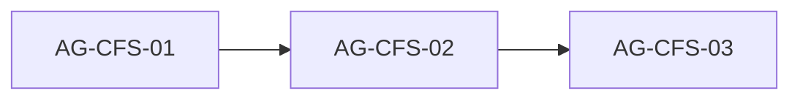

# cta-form-section (milestone 04): проверка Skaro и блоки для агентов

## 0. Важно: объём работ

Функциональность **уже реализована** и отражена в [.skaro/devplan.md](.skaro/devplan.md) (**cta-form-section → done**) и в плане [.cursor/plans/cta-form-and-optimization-agent-blocks.plan.md](.cursor/plans/cta-form-and-optimization-agent-blocks.plan.md) (блоки **AG-CF-01…05 — completed**).

Папка [.skaro/milestones/04-results-about-cta/cta-form-section/](.skaro/milestones/04-results-about-cta/cta-form-section/) — **вторая** точка входа Skaro по той же форме; её `spec.md` / `plan.md` / `tasks.md` **не совпадают** с текущим кодом. Блоки ниже — **синхронизация документации и verify**, а не переписывание `CtaFormSection`.

---

## 1. Источники Skaro (milestone 04)

- [plan.md](.skaro/milestones/04-results-about-cta/cta-form-section/plan.md)
- [spec.md](.skaro/milestones/04-results-about-cta/cta-form-section/spec.md)
- [tasks.md](.skaro/milestones/04-results-about-cta/cta-form-section/tasks.md)
- [clarifications.md](.skaro/milestones/04-results-about-cta/cta-form-section/clarifications.md)
- [verify.yaml](.skaro/milestones/04-results-about-cta/cta-form-section/verify.yaml)

**Расширенный журнал реализации (старый milestone, для справки):** [.skaro/milestones/03-forms-and-final/cta-form-and-optimization/AI_NOTES.md](.skaro/milestones/03-forms-and-final/cta-form-and-optimization/AI_NOTES.md)

---

## 2. Фактическая реализация (канон)

| Область      | Где смотреть                                                                                                                                                |
| ------------ | ----------------------------------------------------------------------------------------------------------------------------------------------------------- |
| Секция формы | [components/sections/CtaFormSection.tsx](components/sections/CtaFormSection.tsx) — `'use client'`, локальный `useState` (не Context), `id="contact"`        |
| Отправка     | [lib/utils/formspree.ts](lib/utils/formspree.ts) — `submitContactFormToFormspree`, **таймаут 12 с**, URL `https://formspree.io/f/${formId}`                 |
| Env          | `**NEXT_PUBLIC_FORMSPREE_ID`** (не полный URL) — [.env.example](.env.example); опционально `**NEXT_PUBLIC_CONTACT_EMAIL`** для mailto                       |
| Валидация    | [lib/validation/contactFormSchema.ts](lib/validation/contactFormSchema.ts) — name min 2, email, **phone ≥ 10 цифр**, message min 10, **honeypot `_gotcha`** |
| Тексты / UX  | [lib/data/texts.ts](lib/data/texts.ts) — `cta.form` (успех, ошибка, «Вернуться», валидация)                                                                 |
| Страница     | [app/page.tsx](app/page.tsx) — **8 секций**, последняя — `CtaFormSection`                                                                                   |

**Нет в проекте:** `lib/utils/mailto.ts`, `npm run export` в [package.json](package.json), `react-hook-form` в зависимостях.

---

## 3. Расхождения Skaro (milestone 04) ↔ код

| Тема                     | Skaro (spec / plan / tasks / verify)                           | Факт в репозитории                                                                                              | Решение для агентов                                                                                 |
| ------------------------ | -------------------------------------------------------------- | --------------------------------------------------------------------------------------------------------------- | --------------------------------------------------------------------------------------------------- |
| **Переменная Formspree** | `NEXT_PUBLIC_FORMSPREE_URL`                                    | `NEXT_PUBLIC_FORMSPREE_ID` + сбор URL в коде                                                                    | Обновить документы milestone: канон **ID**                                                          |
| **Поля формы**           | В spec — name, email, message                                  | Добавлены **phone**, **honeypot** (согласовано в AG-CF / позиционировании)                                      | Расширить FR в `spec.md`, этапы в `plan.md` / `tasks.md`                                            |
| **Таймаут**              | 10 с (plan Stage 1)                                            | **12 с** в `formspree.ts`                                                                                       | Зафиксировать **12 с** в Skaro-доках                                                                |
| **mailto**               | Отдельный `lib/utils/mailto.ts`                                | Логика **внутри** `CtaFormSection` (или вынести — только если отдельным мини-рефакторингом; **не обязательно**) | В plan/tasks: «генерация mailto в компоненте» или путь к вынесенной утилите — как есть после правок |
| **react-hook-form**      | В конце `spec.md` (AI_NOTES)                                   | Не используется; Zod + `useState`                                                                               | Пометить как **опционально** или убрать из spec как обязательную рекомендацию                       |
| **FR-04 mailto**         | `info@example.com`                                             | `NEXT_PUBLIC_CONTACT_EMAIL` / дефолт в коде                                                                     | Привести spec к фактическому поведению                                                              |
| **Статический экспорт**  | DoD и `verify.yaml`: `npm run export`                          | Скрипта **нет**                                                                                                 | Убрать из verify или явно **N/A** (проект на стандартном `next build`)                              |
| **verify.yaml**          | Пути к `lib/utils/mailto.ts`                                   | Файла нет                                                                                                       | Исправить списки файлов для eslint/prettier                                                         |
| **Clarifications**       | Согласованы локальный state, submit validation, SuccessMessage | Совпадает с кодом                                                                                               | Можно оставить; при желании ссылка на ID вместо URL в Q3 — уточнить одной фразой                    |

**Clarifications** (Context, Q2 про Context) по смыслу **совпадают** с кодом; противоречий с «скорректированной реализацией» **нет** — расхождения только в **устаревшем тексте spec/plan/tasks/verify** milestone 04.

---

## 4. Порядок слияния

---

## 5. Задания для агентов

### AG-CFS-01 — AI_NOTES в milestone 04

**Цель:** Один источник правды для Skaro-verify и человека в [.skaro/milestones/04-results-about-cta/cta-form-section/AI_NOTES.md](.skaro/milestones/04-results-about-cta/cta-form-section/AI_NOTES.md).

**Сделать:**

- Краткий обзор: архитектура (client section, локальный state, Zod на submit).
- Таблица: FR из spec ↔ статус в коде (включая phone, honeypot, fallback mailto, таймаут 12 с).
- Явно: канон `**NEXT_PUBLIC_FORMSPREE_ID`**; опционально `NEXT_PUBLIC_CONTACT_EMAIL`.
- Указать, что детальный лог доработок может дублироваться/дополняться [.skaro/milestones/03-forms-and-final/cta-form-and-optimization/AI_NOTES.md](.skaro/milestones/03-forms-and-final/cta-form-and-optimization/AI_NOTES.md).
- Про `npm run export`: не требуется текущим `package.json`, если не вводится `output: 'export'`.

**Проверка:** файл на русском, без противоречий с `CtaFormSection.tsx` и `formspree.ts`.

---

### AG-CFS-02 — Выровнять spec, plan, tasks, verify (milestone 04)

**Цель:** Документы milestone отражают репозиторий; verify выполним без фиктивных путей.

**Сделать:**

- **spec.md:** убрать служебную строку вроде «Вот обновленная полная спецификация…» в начале файла, если осталась; FR-01 — четыре поля + honeypot; FR-02 — ID/env как в `.env.example`; FR-03/04 — как в коде; убрать или смягчить рекомендацию **только** react-hook-form; success-текст — «из `texts.cta.form`», не фиксированная цитата из старого черновика (или цитата = текущая строка из `texts`).
- **plan.md:** таймаут **12 с**; `submitContactFormToFormspree` / имя файла `formspree.ts`; Stage 1 без обязательного отдельного `mailto.ts` **или** задача вынесения помечена опционально; Stage 5 — без `npm run export` **или** с пометкой N/A.
- **tasks.md:** чеклисты под факт (ID, phone, honeypot, пути файлов).
- **verify.yaml:** команды без `mailto.ts`, без `npm run export` (или замена на пояснение); eslint/prettier — только существующие файлы.

**Проверка:** глазами пройти diff — ни один пункт не требует несуществующего файла.

---

### AG-CFS-03 — Регрессия и журнал

**Сделать:**

- `npx tsc --noEmit`, `npm run lint`, `npm run build`.
- Обновить таблицу **§6** в этом файле (журнал ревью).
- В frontmatter todos: `cfs-01`…`cfs-03` → `completed` по факту.

**Не требуется:** менять `devplan` (задача уже **done**), если нет новой существенной доработки кода.

---

## 6. Журнал ревью

| Блок      | Статус | Заметки                                                                                               |
| --------- | ------ | ----------------------------------------------------------------------------------------------------- |
| AG-CFS-01 | готово | AI_NOTES: архитектура, FR↔код, env ID/email, расхождения со spec, export N/A, ссылка на milestone 03. |
| AG-CFS-02 | готово | spec/plan/tasks/verify: ID, 12 с, phone/honeypot, контекст секции, export N/A, verify без mailto.ts.  |
| AG-CFS-03 | готово | `npx tsc --noEmit`, `npm run lint`, `npm run build` — без ошибок (2026-03-24). devplan не менялся.    |

---

## 7. Ревью

После блока: **«Готов AG-CFS-0X»** — обновление to-do и строки журнала в этом файле.