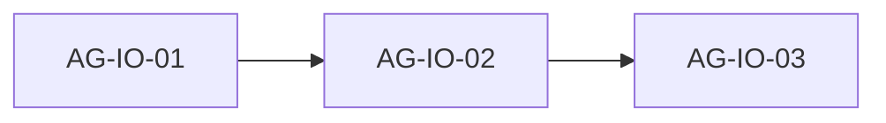

# images-optimization: проверка Skaro и блоки для агентов

## 1. Источники

- План: [.skaro/milestones/05-optimizations/images-optimization/plan.md](.skaro/milestones/05-optimizations/images-optimization/plan.md)
- Spec: [spec.md](.skaro/milestones/05-optimizations/images-optimization/spec.md)
- Tasks: [tasks.md](.skaro/milestones/05-optimizations/images-optimization/tasks.md)
- Clarifications: [clarifications.md](.skaro/milestones/05-optimizations/images-optimization/clarifications.md)
- Verify: [verify.yaml](.skaro/milestones/05-optimizations/images-optimization/verify.yaml)
- Devplan: [images-optimization](.skaro/devplan.md) — **planned**, зависимость от `cta-form-section` (выполнена).

**Связанные ADR / позиционирование:**

- [.skaro/architecture/adr-001-использовать-next.js-15-с-app-router-и-static-site.md](.skaro/architecture/adr-001-использовать-next.js-15-с-app-router-и-static-site.md) — SSG / `output: 'export'`.
- [.skaro/architecture/adr-007-использование-inline-expand-для-кейсов-и-svg-для-г.md](.skaro/architecture/adr-007-использование-inline-expand-для-кейсов-и-svg-для-г.md) — в файле сейчас дублируется текст ADR-002; по смыслу milestone — **inline expand + SVG для графики** там, где возможно.

---

## 2. Фактическое состояние кода

| Область                                                        | Сейчас                                                                                                                                                                                                  |
| -------------------------------------------------------------- | ------------------------------------------------------------------------------------------------------------------------------------------------------------------------------------------------------- |
| `**next/image`, ``**                                      | В `components/**/*.tsx` **нет** ни `next/image`, ни ``.                                                                                                                                            |
| `**[next.config.js](next.config.js)`**                         | `output: 'export'`, `images: { unoptimized: true }` — типично для static export: **оптимизация на лету отключена**, `Image` даёт стабильные размеры, `priority` / `sizes`, без отдельного image server. |
| `**[HeroSection.tsx](components/sections/HeroSection.tsx)`**   | Сплошной фон `bg-[#1B2A4A]`, **без** фонового изображения.                                                                                                                                              |
| `**[CasesSection.tsx](components/sections/CasesSection.tsx)`** | Accordion по тексту; поля `**image` и `metrics` из `[cases.ts](lib/data/cases.ts)` в UI не выводятся**.                                                                                                 |
| `**[ProductCard.tsx](components/sections/ProductCard.tsx)`**   | Только **Lucide**-иконки, растровых картинок в `[products.ts](lib/data/products.ts)` нет.                                                                                                               |
| `**[AboutSection.tsx](components/sections/AboutSection.tsx)`** | Текст и карточки-факты, **без фото** (согласовано с milestone about-section).                                                                                                                           |
| `**public/`**                                                  | Есть `og.png`, `robots.txt`, `sitemap.xml`; **нет** каталога `public/images/cases/` — пути в `cases.ts` сейчас **ведут в никуда**, если их начать рендерить без файлов.                                 |

---

## 3. Расхождения Skaro ↔ реализация / devplan

| Тема                                 | Skaro (spec / plan / tasks)                                                                | Факт / devplan                                                                                                                                                                                          | Решение для агентов                                                                                                                                                                                                                                 |
| ------------------------------------ | ------------------------------------------------------------------------------------------ | ------------------------------------------------------------------------------------------------------------------------------------------------------------------------------------------------------- | --------------------------------------------------------------------------------------------------------------------------------------------------------------------------------------------------------------------------------------------------- |
| **Плейсхолдеры FR-05 / Q1**          | `picsum.photos`                                                                            | Devplan: **SVG + оптимизированные WebP в `public/images/`**                                                                                                                                             | **Канон — локальные файлы** в `public/images/…`; remote + `remotePatterns` только если осознанно нужен внешний хостинг. Picsum — не обязателен; при отсутствии брендовых фото — сжатые WebP-заглушки в репозитории.                                 |
| **Hero**                             | Фоновое `next/image`, `priority`, `fetchPriority`                                          | Сейчас **нет** картинки                                                                                                                                                                                 | Либо **добавить** фон (WebP в `public`) с `fill` + overlay, либо **зафиксировать в spec/AI_NOTES**, что LCP — не растровое фото, hero остаётся плашкой; не ломать контраст текста.                                                                  |
| **Cases**                            | `next/image`, lazy в свёрнутом                                                             | Картинки **не рендерятся**                                                                                                                                                                              | Подключить `item.image` через `**next/image`**; `**sizes`** как в clarifications Q3; для accordion лучше **монтировать `Image` только при `openStates[i] === true`** (строже, чем один только `loading="lazy"` вне viewport — см. примечание ниже). |
| **ProductLine / About (Stage 4)**    | Растровые фото в карточках и About                                                         | **Продукты — SVG-иконки**; **About — без фото**                                                                                                                                                         | **Не вводить** растровые изображения в `ProductCard` и `AboutSection` без отдельного решения по дизайну; обновить **plan/tasks/spec** milestone: явные **исключения** («растр только Hero + Cases» или согласованный список).                       |
| **Центральный `lib/data/images.ts`** | Обязательный реестр + `types/images.ts`                                                    | Можно упростить                                                                                                                                                                                         | **KISS:** достаточно полей в `cases` (и при необходимости hero-константа в `texts` / малом модуле); отдельный реестр — по необходимости, не ради объёма.                                                                                            |
| `**next export` / verify**           | `next build && next export`, `require('./lib/data/images.ts')`, PowerShell `out/_next/...` | В проекте `**next build`** при `output: 'export'` уже кладёт артефакты в `out/`; отдельного скрипта `export` в [package.json](package.json) **нет**; `require` `.ts` без трансформации **не сработает** | Verify: `**npm run build`**; проверка ассетов — `node` + `fs.existsSync` или список путей; команда размера бандла — опционально, с пометкой платформы.                                                                                              |
| **NFR бандл 150 KB**                 | Жёсткий ориентир                                                                           | Уже обсуждалось на CTA-milestone                                                                                                                                                                        | Зафиксировать **факт измерения** в AI_NOTES; не блокировать релиз одной цифрой.                                                                                                                                                                     |
| **Спек: все AC с `[x]`**             | Отмечено выполненным                                                                       | Код **не** соответствует                                                                                                                                                                                | После работы — **пересмотреть чекбоксы** в spec или перевести в «после внедрения».                                                                                                                                                                  |

**Примечание FR-06 / Q5:** ответ Skaro «`loading='lazy'`» для **скрытого** аккордеона часто **всё равно грузит**, если узел в DOM и попадает во viewport. Для «только после раскрытия» надёжнее **условный рендер** `{open && <Image … />}`. В AI_NOTES кратко описать выбранную стратегию.

**Противоречий с уже согласованным about / продуктами нет**, если **не** тащить в код обязательные фото About и продуктов из старого текста Skaro Stage 4.

---

## 4. Порядок слияния

---

## 5. Задания для агентов

### AG-IO-01 — Ассеты и конфигурация

**Цель:** Убрать «битые» пути и подготовить основу под `next/image`.

**Сделать:**

- Создать `**public/images/cases/`** и положить **три WebP** под пути из `[lib/data/cases.ts](lib/data/cases.ts)` (`case1.webp` …) — допустимы компактные заглушки с разумными пропорциями; при появлении брендовых файлов — заменить.
- При решении о фоне Hero (см. IO-02) — заранее положить, например, `public/images/hero/hero-bg.webp` или согласовать отсутствие файла.
- `[next.config.js](next.config.js)`: добавлять `**images.remotePatterns`** только если используются **внешние** URL; при чисто локальном `public/` — не обязательно.
- Расширить тип/данные кейса при необходимости: `**alt`**, `**width` / `height`** (для CLS и `Image`), без дублирования пути — поле `image` уже есть.

**Проверка:** файлы на диске; `npm run build` не падает после появления ссылок в коде (IO-02).

---

### AG-IO-02 — Hero и Cases

**Цель:** Включить `next/image` там, где появляется растр.

**Сделать:**

- **Hero:** по согласованию в чате/заметке в PR: **вариант A** — фоновый `Image` (`fill`, контейнер `min-h`/`relative`, `**priority`**, `**fetchPriority="high"`**, overlay для читаемости); **вариант B** — оставить плашку, в **AI_NOTES** описать, почему FR-02 не применяется (нет LCP-image).
- **Cases:** внутри раскрытого блока вывести превью кейса через `**next/image`**; `**sizes="(max-width: 768px) 100vw, (max-width: 1200px) 50vw, 33vw"`** (Q3); предпочтительно рендер только при открытой панели; корректный `**alt**` (из данных или из заголовка кейса).
- Сохранить **a11y** и текущий стиль секции.

**Проверка:** визуально mobile/desktop; нет 404 по новым путям.

---

### AG-IO-03 — Исключения, Skaro, verify, AI_NOTES, QA

**Цель:** Закрыть milestone документально и технически без ложных DoD.

**Сделать:**

- Явно задокументировать: **ProductLine** — иконки Lucide, **растровый `next/image` не требуется**; **About** — без фотографий, **не добавлять** картинки из старого Stage 4 без нового ТЗ.
- Обновить в [.skaro/milestones/05-optimizations/images-optimization/](.skaro/milestones/05-optimizations/images-optimization/) **spec.md**, **plan.md**, **tasks.md** под факт (локальные WebP, без обязательного picsum, без фото About/продуктов, `next build` вместо несуществующего `npm run export`, убрать вводящие в заблуждение преждевременные `[x]`).
- Исправить **[verify.yaml](.skaro/milestones/05-optimizations/images-optimization/verify.yaml)**: рабочие команды без `require` сырого `.ts`; опциональная проверка размера — с комментарием про ОС.
- Создать **[.skaro/milestones/05-optimizations/images-optimization/AI_NOTES.md](.skaro/milestones/05-optimizations/images-optimization/AI_NOTES.md)** — архитектура изображений, `unoptimized` + export, список путей, замена заглушек на прод, CWV чеклист **как ориентир**.
- **README:** только если команда договорилась (в Skaro Stage 5 было обязательно — можно краткий подраздел «Изображения» или отсылка к AI_NOTES).
- `**npm run lint`**, `**npx tsc --noEmit`**, `**npm run build**`.

**После ревью:** при необходимости строка в [.skaro/devplan.md](.skaro/devplan.md) Change Log и статус **images-optimization → done**.

---

## 6. Журнал ревью

| Блок     | Статус | Заметки                                                                                                                                          |
| -------- | ------ | ------------------------------------------------------------------------------------------------------------------------------------------------ |
| AG-IO-01 | готово | `public/images/cases/*.webp`, тип `Case` + размеры/alt в `cases.ts`, hero без файла до IO-02, без `remotePatterns`; build + type-check OK.       |
| AG-IO-02 | готово | Hero: Image fill, priority, overlay, `backgroundSrc/Alt` в texts; `hero.webp`; Cases: Image только при open, sizes, lazy, a11y кнопки; build OK. |
| AG-IO-03 | готово | spec/plan/tasks/verify/clarifications + AI_NOTES; devplan done + Change Log; lint/tsc/build OK; README — по договорённости.                      |

---

## 7. Ревью

После блока: **«Готов AG-IO-0X»** — обновление to-do и строки журнала в этом файле.