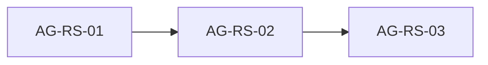

# results-section: проверка плана Skaro и блоки для агентов

## 1. Источники

- План стадий: [.skaro/milestones/04-results-about-cta/results-section/plan.md](.skaro/milestones/04-results-about-cta/results-section/plan.md)
- Spec: [.skaro/milestones/04-results-about-cta/results-section/spec.md](.skaro/milestones/04-results-about-cta/results-section/spec.md)
- Tasks: [tasks.md](.skaro/milestones/04-results-about-cta/results-section/tasks.md)
- Clarifications: [clarifications.md](.skaro/milestones/04-results-about-cta/results-section/clarifications.md)

**Текущая реализация (канон после сверки с позиционированием):**

- [components/sections/ResultsSection.tsx](components/sections/ResultsSection.tsx) — Server Component, `id="results"`, фон `#1B2A4A`, заголовок + **intro** + **три колонки** с буллетами из данных.
- [lib/data/texts.ts](lib/data/texts.ts) — `texts.results`: `title` «Ориентиры по уровням сотрудничества», дисклеймер, `columns[]` с `heading` + `points[]` по **трём уровням пакетов** (базовый / внедрение / сопровождение), цифры из продуктовой линейки (3–4 нед, 15–25%, 3–6 мес, 30%, квартальный рост и т.д.).
- [types/index.ts](types/index.ts) — `ResultsColumn`, вложенный тип в `TextsData.results`.

---

## 2. Расхождения Skaro ↔ текущая реализация и решение

| Тема                          | Skaro (spec / plan / clarifications)                   | Сейчас в репозитории                                                                                                                                                      | Решение для milestone                                                                                                                                   |
| ----------------------------- | ------------------------------------------------------ | ------------------------------------------------------------------------------------------------------------------------------------------------------------------------- | ------------------------------------------------------------------------------------------------------------------------------------------------------- |
| **Смысл блока**               | «Твёрдые цифры», 4 KPI в духе маркетинга               | **Ориентиры по пакетам**, без «гарантий», привязка к [.cursor/docs/Produktovaia-lineika-i-offery-FactoryAll.md](.cursor/docs/Produktovaia-lineika-i-offery-FactoryAll.md) | **Сохранить текущую модель контента** (позиционирование важнее устаревшего FR-02).                                                                      |
| **FR-02 / Stage 1**           | Массив из **4** метрик: 3–6 мес, 30%+, 20–35%, 3 кейса | Три колонки; часть цифр **внутри** текстов буллетов; **нет** отдельного `resultsMetrics`                                                                                  | **Не вводить** параллельный `resultsMetrics: ResultMetric[]` с четырьмя карточками без отдельного решения заказчика (дублирование и смешение смыслов).  |
| **Сетка**                     | 4 колонки на desktop (`lg:grid-cols-4`)                | 3 колонки (`md:grid-cols-3`) под **3 продукта**                                                                                                                           | Оставить **3 колонки**; при желании визуально усилить «карточность» колонок.                                                                            |
| **Иконки (FR-04)**            | Иконка **над каждой метрикой** (4 штуки)               | Иконок нет                                                                                                                                                                | Добавить **опционально по одной иконке на колонку** (3 иконки), например через `lucide-react` или inline SVG — выполняет дух FR-04 без ломки структуры. |
| **Анимации**                  | Нет JS-анимаций (clarification C)                      | Статика                                                                                                                                                                   | Без изменений.                                                                                                                                          |
| **Палитра (NFR-02)**          | Navy + Amber цифры + белый текст                       | Тёмный фон, белый/серый текст; **акцент Amber на числах в буллетах не выделен типографикой**                                                                              | При полировке: выделить **ключевые числа** в строках (например ``) **без** смены смысла текста.                           |
| **tailwind.config.ts** в plan | Упомянут как вход                                      | Файл [tailwind.config.ts](tailwind.config.ts) есть                                                                                                                        | Использовать при необходимости для токенов; проект на Tailwind 4 — не выходить за принятые паттерны.                                                    |

**Итог:** формальных «противоречий нет» — **неверно**: FR-02 и Stage 1–2 Skaro описывают **другой продукт секции**. Для milestone принято **не откатывать** согласованный копирайт; задача Skaro трактуется как **доведение UX/визуала и типизации** в рамках уже выбранной структуры **intro + 3 колонки**.

Если позже понадобится именно полоса из **4 KPI** как в clarifications — это **отдельное** согласование с маркетингом (риск дублирования с колонками).

---

## 3. Порядок слияния

Последовательно: данные/типы → компонент → QA.

---

## 4. Готовые задания для агенту

### AG-RS-01 — Данные и типы

**Цель:** Усилить типизацию и при необходимости структуру данных **без** замены модели «3 колонки».

**Сделать:**

- В [types/index.ts](types/index.ts): при необходимости расширить `ResultsColumn`, например опциональные поля `icon?: 'TrendingUp' | 'Settings2' | ...` (строковый ключ под lucide) или `icon?: string` — на усмотрение реализации.
- В [lib/data/texts.ts](lib/data/texts.ts): заполнить новые поля для трёх колонок, если введены; **не** добавлять `resultsMetrics` с четырьмя элементами FR-02 без явного запроса заказчика.
- Убедиться, что тексты по-прежнему согласованы с продуктовой линейкой (цифры 15–25%, 30%, сроки и т.д.).

**Не делать:** удалять `intro` или переходить на четыре однотипные KPI-карточки вместо колонок.

**Проверка:** `npx tsc --noEmit`.

---

### AG-RS-02 — Компонент ResultsSection

**Цель:** Server Component, визуал в духе Skaro NFR (тёмный фон, акцент Amber, адаптив), **сохранив** разметку intro + три колонки.

**Сделать:**

- [components/sections/ResultsSection.tsx](components/sections/ResultsSection.tsx): при наличии иконок в данных — отобразить над заголовком колонки или рядом; улучшить иерархию типографики.
- Выделить **числа и проценты** в буллетах классом `text-accent` (или эквивалент `#F59E0B`), где это уместно и не ломает читаемость (можно точечно в данных через лёгкий markdown запретён — лучше разбить строку на части в данных или маленький хелпер).
- Сетка: **1 / 3** (например `grid-cols-1 md:grid-cols-3`); опционально промежуточный breakpoint по желанию.
- Сохранить `id="results"`, отсутствие `'use client'`.

**Проверка:** визуально desktop/mobile; контраст с соседними секциями.

---

### AG-RS-03 — Интеграция, QA, документация Skaro

**Цель:** Закрыть milestone без противоречия devplan.

**Сделать:**

- [app/page.tsx](app/page.tsx): порядок секций — `ResultsSection` между `ProductLineSection` и `AboutSection` (уже ожидаемо); при отклонении — вернуть.
- [components/sections/index.ts](components/sections/index.ts): экспорт `ResultsSection`.
- `npm run lint`, `npm run build`; якорь `#results` из [navigation.ts](lib/data/navigation.ts).
- По желанию: короткий **AI_NOTES.md** в [.skaro/milestones/04-results-about-cta/results-section/](.skaro/milestones/04-results-about-cta/results-section/) с пометкой, что **FR-02 spec заменён фактической моделью** «ориентиры по пакетам» после сверки с позиционированием (чтобы Skaro не переоткрыл старые задачи слепо).

**Не обязательно:** менять статус `results-section` в [devplan](.skaro/devplan.md), если он уже **done**; при существенных доработках — строка в Change Log.

---

## 5. Журнал ревью

| Блок     | Статус  | Заметки                                                                                                                                                                                                   |
| -------- | ------- | --------------------------------------------------------------------------------------------------------------------------------------------------------------------------------------------------------- |
| AG-RS-01 | Принято | `ResultsColumnIcon` + `icon?` в колонках; порядок Search / Settings2 / TrendingUp совпадает с продуктами; копирайт без изменений; `resultsMetrics` нет. `tsc` OK. Иконки в UI — AG-RS-02.                 |
| AG-RS-02 | Принято | Server Component, сетка 1/3, карточки колонок, границы секции, иконки lucide как у продуктов, `renderPointWithMetricAccents`, a11y `aria-labelledby` / `aria-hidden` на иконках. `tsc`, lint, build — OK. |
| AG-RS-03 | Принято | Интеграция подтверждена; lint/build OK; [AI_NOTES.md](.skaro/milestones/04-results-about-cta/results-section/AI_NOTES.md) — FR-02 vs «ориентиры по пакетам». devplan без изменений.                       |

---

## 6. Сообщение для ревью

После каждого блока: **«Готов AG-RS-0X»** — ревью и отметка в журнале + to-do в frontmatter этого файла.