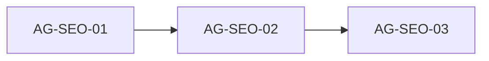

# seo-metadata: проверка Skaro и блоки для агентов

## 0. Критично: эталон текста Skaro **не принимать как замену**

Предложенный Skaro фрагмент (`title` / `description` / `keywords` про «малые и средние производства», «снижаем срывы на 30%», «потери 20–35%», OG `og-image.png`) **противоречит** уже выровненному позиционированию на главной:

- Сейчас в `[app/layout.tsx](app/layout.tsx)`: акцент на **MES и цифровой контур операционного управления**, формулировка про **ИИ только при надёжных данных**, без жёстких процентов в meta description.
- OG-файл в репозитории — `**/og.png`**, не `og-image.png`.

**Решение:** в работах агентов **сохранять** (или слегка редактировать только согласованно с [.cursor/docs/Pozitsionirovanie-FactoryAll.md](.cursor/docs/Pozitsionirovanie-FactoryAll.md)) текущие `siteTitle` / `siteDescription` / `keywords`; в документах Skaro явно указать, что эталон из шаблона **заменён** на копирайт лендинга.

---

## 1. Источники Skaro

- [plan.md](.skaro/milestones/05-optimizations/seo-metadata/plan.md)
- [spec.md](.skaro/milestones/05-optimizations/seo-metadata/spec.md)
- [tasks.md](.skaro/milestones/05-optimizations/seo-metadata/tasks.md)
- [clarifications.md](.skaro/milestones/05-optimizations/seo-metadata/clarifications.md)
- [verify.yaml](.skaro/milestones/05-optimizations/seo-metadata/verify.yaml)

**Зависимость devplan:** [seo-metadata](.skaro/devplan.md) — **done**; meta, OG, Twitter, `robots.txt`, `sitemap.xml`, `og.png`, `AI_NOTES`, `verify.yaml`; **schema.org** / favicon в `metadata.icons` — опционально позже.

---

## 2. Фактическое состояние

| Тема                               | Сейчас                                                                                                                                                                                                                                                                                                  |
| ---------------------------------- | ------------------------------------------------------------------------------------------------------------------------------------------------------------------------------------------------------------------------------------------------------------------------------------------------------- |
| `[app/layout.tsx](app/layout.tsx)` | `metadata`: `metadataBase` из env + fallback `https://factoryall.ru`, `title` / `description` / `keywords`, `robots`, `authors` / `creator`, `openGraph` (в т.ч. `locale: 'ru_RU'`, `siteName`, `images: /og.png` 1200×630), `twitter` `summary_large_image`, `alternates.canonical: '/'`. `lang="ru"`. |
| Twitter Cards                      | Есть: `metadata.twitter` согласован с OG.                                                                                                                                                                                                                                                               |
| Базовый URL                        | `NEXT_PUBLIC_SITE_URL` в `.env.example`; в коде `process.env.NEXT_PUBLIC_SITE_URL?.trim()                                                                                                                                                                                                               |
| Статика                            | `[public/robots.txt](public/robots.txt)`, `[public/sitemap.xml](public/sitemap.xml)`, `[public/og.png](public/og.png)` — ок (Q4).                                                                                                                                                                       |
| Favicon / `metadata.icons`         | В `public/` пока нет выделенных иконок под `metadata.icons` — опционально; см. `AI_NOTES.md`.                                                                                                                                                                                                           |
| `authors` / `creator`              | Задано как бренд FactoryAll.                                                                                                                                                                                                                                                                            |

---

## 3. Расхождения Skaro ↔ код (кратко)

| Тема                  | Skaro                                            | Факт / решение                                                                                                                                                                                     |
| --------------------- | ------------------------------------------------ | -------------------------------------------------------------------------------------------------------------------------------------------------------------------------------------------------- |
| **Копирайт meta**     | Эталон с процентами и узким MES                  | **Оставить** текущий копирайт layout (позиционирование).                                                                                                                                           |
| **OG-картинка**       | `og-image.png` в примере                         | `**/og.png`** — канон репозитория.                                                                                                                                                                 |
| `**metadataBase`**    | Через `NEXT_PUBLIC_SITE_URL`                     | Ввести `**process.env.NEXT_PUBLIC_SITE_URL`** с **fallback `https://factoryall.ru`** (и при необходимости `http://localhost:3000` только для локальной отладки превью — зафиксировать в AI_NOTES). |
| **Абсолютные OG URL** | Явно через интерполяцию env                      | Достаточно `**metadataBase` + относительный путь** к изображению — Next сформирует абсолютные URL; в spec указать это как допустимую реализацию FR.                                                |
| **Twitter**           | `summary_large_image`                            | Реализовано в `layout.tsx`.                                                                                                                                                                        |
| `**metadata.robots`** | В примере Skaro                                  | **Опционально**; индексация уже в `robots.txt`.                                                                                                                                                    |
| **Stage 2**           | `seo-validator.ts` + `docs/SEO.md`               | **KISS:** приоритет **AI_NOTES** в milestone; валидатор и отдельный `docs/SEO.md` — **по договорённости** (правило проекта — не плодить markdown без нужды).                                       |
| **verify.yaml**       | ESLint/Prettier для `lib/utils/seo-validator.ts` | Если валидатор **не** вводится — править verify **только** на существующие файлы (например, только `app/layout.tsx`).                                                                              |
| **spec.md**           | Служебная первая строка                          | Удалить при выравнивании.                                                                                                                                                                          |

---

## 4. Порядок слияния

---

## 5. Задания для агентов

### AG-SEO-01 — `layout.tsx`, env, Twitter

**Сделать:**

- Добавить в `[.env.example](.env.example)` `**NEXT_PUBLIC_SITE_URL`** с комментарием (prod: `https://factoryall.ru`, превью/Vercel — свой URL). **Не удалять** существующие строки про Formspree — в проекте канон `**NEXT_PUBLIC_FORMSPREE_ID`**; при обнаружении устаревшего ключа в `.env.example` — одна правка на согласованность с кодом (не смешивать с SEO лишним рефакторингом).
- В `[app/layout.tsx](app/layout.tsx)`: `metadataBase: new URL(process.env.NEXT_PUBLIC_SITE_URL ?? 'https://factoryall.ru')` (или эквивалент с константой fallback); **не** подменять `siteTitle` / `siteDescription` / `keywords` на эталон Skaro.
- Добавить `**twitter`**: `card: 'summary_large_image'`, title/description/images согласованы с OG (путь `**/og.png`**).
- По желанию: `**metadata.robots**` `{ index: true, follow: true }`; `**authors**` / `**creator**` — строка вроде «FactoryAll».
- **Иконки:** если добавляются файлы в `public/` — прописать `metadata.icons`; иначе — пункт в AI_NOTES «favicon — по желанию».

**Проверка:** `npx tsc --noEmit`, `npm run build`; при необходимости ручная проверка `<head>` (OG + twitter).

---

### AG-SEO-02 — Документация и verify

**Сделать:**

- Создать [.skaro/milestones/05-optimizations/seo-metadata/AI_NOTES.md](.skaro/milestones/05-optimizations/seo-metadata/AI_NOTES.md): структура metadata, `metadataBase` + env, почему копирайт ≠ шаблон Skaro, пути `og.png` / robots / sitemap, чеклист перед деплоем (Facebook Sharing Debugger, LinkedIn и т.д.).
- **Опционально:** `lib/utils/seo-validator.ts` и/или `docs/SEO.md` — только если нужен явный gate; иначе verify без этих путей.
- Обновить **[verify.yaml](.skaro/milestones/05-optimizations/seo-metadata/verify.yaml)**: команды ESLint/Prettier **только для файлов, которые существуют**; проверка наличия `public/robots.txt`, `sitemap.xml`, `og.png` (node `fs` или кроссплатформенно, избегать обязательного PowerShell в единственном варианте — см. images-optimization).

**Проверка:** все команды из verify выполнимы на Windows/Linux.

---

### AG-SEO-03 — Синхронизация milestone и devplan

**Сделать:**

- Привести **spec.md**, **plan.md**, **tasks.md**, при необходимости **clarifications.md** (примечание: копирайт — с лендинга, не обязательный текст из старого примера) к факту.
- Убрать ложные «всё готово» в AC, если были.
- [.skaro/devplan.md](.skaro/devplan.md): **seo-metadata → done**, строка в Change Log.
- Обновить журнал §6 в этом файле плана агентов.

**Проверка:** `npm run lint`, `tsc`, `build` по желанию повторно.

---

## 6. Журнал ревью

| Блок      | Статус | Заметки                                                                                                                                                                                                |
| --------- | ------ | ------------------------------------------------------------------------------------------------------------------------------------------------------------------------------------------------------ |
| AG-SEO-01 | готово | `NEXT_PUBLIC_SITE_URL` + FORMSPREE_ID в `.env.example`; `metadataBase`, Twitter, robots, authors/creator; общий `ogImage`; копирайт без замены; черновик AI_NOTES (favicon/localhost); tsc + build OK. |
| AG-SEO-02 | готово | AI_NOTES: структура metadata, env, копирайт ≠ Skaro, пути OG/robots/sitemap, чеклист деплоя; verify без seo-validator, ESLint/Prettier только `app/layout.tsx`; проверка public через `node -e`.       |
| AG-SEO-03 |        |                                                                                                                                                                                                        |

---

## 7. Ревью

После блока: **«Готов AG-SEO-0X»** — обновление to-do и строки журнала в этом файле.