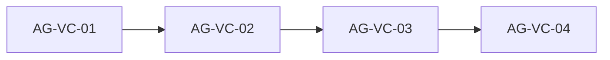

# vercel-deploy-config: проверка milestone и блоки агентов

## Источники

- Milestone: [.skaro/milestones/06-testing-deployment/vercel-deploy-config/](../../.skaro/milestones/06-testing-deployment/vercel-deploy-config/)
- ADR: [.skaro/architecture/adr-004-деплой-на-vercel-с-использованием-next-export-для-.md](../../.skaro/architecture/adr-004-деплой-на-vercel-с-использованием-next-export-для-.md)
- Канон продукта/копирайта (без правок под деплой): [.cursor/docs/Pozitsionirovanie-FactoryAll.md](../docs/Pozitsionirovanie-FactoryAll.md), [.cursor/docs/Produktovaia-lineika-i-offery-FactoryAll.md](../docs/Produktovaia-lineika-i-offery-FactoryAll.md)
- Код: [next.config.js](../../next.config.js), [package.json](../../package.json), [playwright.config.ts](../../playwright.config.ts), [e2e/](../../e2e/), [.env.example](../../.env.example)

## Фактическое состояние (репозиторий)

| Тема                | Как сейчас                                                                                                 |
| ------------------- | ---------------------------------------------------------------------------------------------------------- |
| Статический экспорт | `output: 'export'`, `images.unoptimized: true` в `next.config.js`                                          |
| trailingSlash       | **Не задан** (по умолчанию `false`) — расхождение с FR-05 milestone                                        |
| vercel.json         | **Отсутствует**                                                                                            |
| Сайт                | Одностраничный лендинг: маршрут фактически `**/`**, форма и якорь `**#contact`** (нет страницы `/contact`) |
| E2E                 | Уже есть `sections.spec.ts`, `contact-form.spec.ts`; `webServer` → `serve out`                             |
| README              | Есть dev/build/e2e; **нет** раздела про Vercel                                                             |
| .env.example        | `NEXT_PUBLIC_SITE_URL`, `NEXT_PUBLIC_FORMSPREE_ID`, опционально `NEXT_PUBLIC_CONTACT_EMAIL`                |

## Расхождения Skaro ↔ код (и решение)

| Тема                      | Skaro / milestone                                                                                          | Факт в репо                                                                                                                                                                 | Решение                                                                                                                                                                                                                                     |
| ------------------------- | ---------------------------------------------------------------------------------------------------------- | --------------------------------------------------------------------------------------------------------------------------------------------------------------------------- | ------------------------------------------------------------------------------------------------------------------------------------------------------------------------------------------------------------------------------------------- |
| Пути в AC и verify        | Примеры `/contact`, `out/contact/index.html`                                                               | Нет роута `contact`                                                                                                                                                         | В spec/tasks/verify оперировать `**/`** и при необходимости проверкой якоря на клиенте (уже в e2e), не выдумывать `out/contact/`                                                                                                            |
| Конфиг Next               | Упоминания `next.config.js`                                                                                | Файл — `**next.config.js`**                                                                                                                                                 | В документах milestone везде `**.js`**, без вымышленного `.ts`                                                                                                                                                                              |
| Stage 1 / plan DoD        | Все пункты отмечены `[x]`                                                                                  | Часть ещё не делалась в рамках этого трека                                                                                                                                  | Снять ложные `[x]` до факта или явно пометить «уже было в репо до задачи»                                                                                                                                                                   |
| Stage 4                   | `scripts/validate-config.js`, `e2e/vercel-config.spec.ts`, проверка CSP без `unsafe-inline`, `test:vercel` | Локальный `**serve out` не применяет** `vercel.json` → заголовки Vercel в Playwright на `serve` **не видны**; жёсткая CSP легко ломает Next/Tailwind без отдельного дизайна | **KISS:** лёгкий скрипт проверки структуры `vercel.json` (и при желании ключей `next.config.js`), **без** обязательного e2e на security headers в CI; проверку заголовков — в README (`curl -I` на **Preview/Production** или `vercel dev`) |
| verify.yaml               | PowerShell `Test-Path`                                                                                     | Не кроссплатформенно                                                                                                                                                        | Заменить на `**node -e`** + `fs` (как в других milestones проекта)                                                                                                                                                                          |
| Git integration (devplan) | «Git integration (ADR-004)»                                                                                | Настраивается в UI Vercel, не файлом в репо                                                                                                                                 | Описать шаги в README (import repo, branch `main`, auto Preview)                                                                                                                                                                            |
| Позиционирование / офферы | —                                                                                                          | Не задают технический деплой                                                                                                                                                | **Без изменений** в `.cursor/docs/`                                                                                                                                                                                                         |

**Вывод:** противоречий с позиционированием и продуктовой линейкой нет. Противоречия только между шаблонным текстом Skaro (многостраничный пример `/contact`) и **одностраничной** реализацией — канон: код и якоря `#contact`.

## Порядок слияния

## Задания для агентов

### AG-VC-01 — Next.js: trailingSlash и регрессия

**Цель:** Закрыть FR-05 milestone без поломки существующего лендинга и E2E.

**Сделать:**

1. В [next.config.js](../../next.config.js) добавить `trailingSlash: true` (рядом с `output: 'export'`).
2. Убедиться, что внутренние ссылки по-прежнему корректны: в проекте в основном якоря `#…` и `Link href="/"` — при сомнении прогнать поиск по `href="/` и `Link`.
3. Выполнить `npm run build` и `npm run test:e2e` (или эквивалент из CI). При падении — поправить конфиг/тесты минимально (например, ожидания URL, если что-то редиректит).

**Проверка:** сборка успешна; все текущие Playwright-тесты зелёные.

---

### AG-VC-02 — vercel.json

**Цель:** FR-01, FR-03, совместимость со статическим `out/` и формой Formspree.

**Сделать:**

1. Добавить в корень [vercel.json](../../vercel.json) с `cleanUrls: true`.
2. Блок `headers` с `source: "/(.*)"` (или эквивалент, принятый схемой Vercel), включая минимум:
  - `X-Frame-Options: DENY`
  - `X-Content-Type-Options: nosniff`
  - `Referrer-Policy: strict-origin-when-cross-origin`
  - `Content-Security-Policy` — **практично** для статического Next export: `default-src 'self'`; `script-src 'self'`; `style-src 'self'` (и при необходимости `'unsafe-inline'` только если без этого ломается отображение — зафиксировать выбор в комментарии в PR/README); `img-src 'self' data:`; `font-src 'self'`; `form-action https://formspree.io` (или шаблон под ваш endpoint); `connect-src` при необходимости для Formspree/домена сайта; `frame-ancestors 'none'`.
3. По желанию milestone: `X-XSS-Protection: 1; mode=block` (устаревающий заголовок; можно для формального совпадения со spec).
4. **Не** добавлять лишние `rewrites`/`routes`, если не требуется для 404 (clarifications: опора на `cleanUrls` и поведение Vercel для статики).

**Проверка:** JSON валиден; после деплоя на Preview — ручная или `curl -I` проверка заголовков (полный автотест на заголовки в CI без Vercel — вне scope, см. AG-VC-04).

---

### AG-VC-03 — README и переменные окружения

**Цель:** FR-02 и пункт devplan про env для Formspree / сайта.

**Сделать:**

1. В [README.md](../../README.md) добавить раздел **«Деплой на Vercel»** с шагами: аккаунт Vercel → Import Git Repository → Framework Preset Next.js → Build Command `npm run build` (или `next build`) → Output Directory `**out`** → Environment Variables по списку из [.env.example](../../.env.example) (`NEXT_PUBLIC_SITE_URL` для превью — URL вида `https://<project>.vercel.app`, `NEXT_PUBLIC_FORMSPREE_ID`, при необходимости `NEXT_PUBLIC_CONTACT_EMAIL`).
2. Кратко: **Preview** на PR (NFR-01), **Production** на `main` — в духе ADR-004.
3. Локально: `npx vercel dev` или сборка + `serve out` — что из этого имитирует прод лучше (явно написать: заголовки из `vercel.json` на `serve` не применяются).
4. Подраздел **Troubleshooting:** 404 на путях (проверить `out/`, `cleanUrls`, trailing slash), пустой/неверный `NEXT_PUBLIC_SITE_URL` на превью (OG/metadata), блокировки CSP в консоли браузера.
5. Ссылка на официальную документацию Vercel (deploy Next.js / static export).

**Проверка:** по README можно пройти импорт проекта без догадок; имена env совпадают с `.env.example`.

---

### AG-VC-04 — Skaro, verify, лёгкая валидация, devplan

**Цель:** Убрать шаблонные несоответствия, сделать verify выполнимым везде, зафиксировать ограничения проверки заголовков.

**Сделать:**

1. Обновить [.skaro/milestones/06-testing-deployment/vercel-deploy-config/spec.md](../../.skaro/milestones/06-testing-deployment/vercel-deploy-config/spec.md): AC про маршруты — под **одностраничный** сайт (`/`, при необходимости редирект/слеш); убрать или заменить проверки `out/contact/`; явно указать, что проверка security headers на стороне Vercel — **Preview/Production** или `vercel dev`, не через `serve out`.
2. Обновить [plan.md](../../.skaro/milestones/06-testing-deployment/vercel-deploy-config/plan.md), [tasks.md](../../.skaro/milestones/06-testing-deployment/vercel-deploy-config/tasks.md): убрать ложные `[x]`; Stage 4 упростить под решение из таблицы расхождений (без обязательного `e2e/vercel-config.spec.ts` в CI, если не выбран отдельный контур с `vercel dev` + авторизацией).
3. Переписать [verify.yaml](../../.skaro/milestones/06-testing-deployment/vercel-deploy-config/verify.yaml) на **кроссплатформенные** команды: `npm run build`, `node -e "..."` для проверки `out/index.html` (и при согласовании со spec — наличия ожидаемых статических файлов), опционально `node scripts/validate-vercel-config.mjs` (или `.js`) — разбор JSON и наличие `cleanUrls`, массива `headers`.
4. При добавлении скрипта — зарегистрировать в [package.json](../../package.json) короткий скрипт вида `validate:vercel` (имя согласовать с verify).
5. Добавить `AI_NOTES.md` в папку milestone: фактические решения, ограничение про заголовки и `serve`, соответствие ADR-004.
6. После ревью ведущего чата: [.skaro/devplan.md](../../.skaro/devplan.md) — задача `vercel-deploy-config` → `done` и строка в Change Log (как в прошлых задачах).

**Проверка:** команды из `verify.yaml` выполняются из корня репо на Windows и Unix; нет ссылок на несуществующие файлы.

---

## Журнал ревью

| Блок     | Статус | Заметки                                                                                                                                                                                                                                                                                                                   |
| -------- | ------ | ------------------------------------------------------------------------------------------------------------------------------------------------------------------------------------------------------------------------------------------------------------------------------------------------------------------------- |
| AG-VC-01 | готово | `trailingSlash: true` в `next.config.js`; единственный путь `Link href="/"` без конфликта; `npm run build` + `npm run test:e2e` — 10 passed.                                                                                                                                                                              |
| AG-VC-02 | готово | `vercel.json`: `cleanUrls`, `headers` на `/:path`*. CSP с `'unsafe-inline'` для script/style (Next export + `next/image`); Formspree в `connect-src` и `form-action`; `frame-ancestors 'none'`. Заголовки проверять на Vercel (`curl -I`).                                                                                |
| AG-VC-03 | готово | README: раздел «Деплой на Vercel» (шаги Dashboard, `out`, env как в `.env.example`, Preview/PR и Production), локально `serve` vs `vercel dev`, CSP/unsafe-inline, troubleshooting, ссылки на docs.vercel.com. `.env.example` не менялся — уже полон.                                                                     |
| AG-VC-04 | готово | spec/plan/tasks переписаны под одностраничный сайт и факт; `verify.yaml` — `validate:vercel`, `build`, `check:out`, `test:e2e`, eslint; скрипты `scripts/validate-vercel-config.js`, `check-static-out.js`; override eslint для `scripts/**/*.js`; `AI_NOTES.md`; **vercel-deploy-config** → done в devplan + Change Log. |

После выполнения блока пришлите сообщение вида **«Готов AG-VC-NN»** с кратким отчётом — обновим todo в frontmatter и строку журнала.